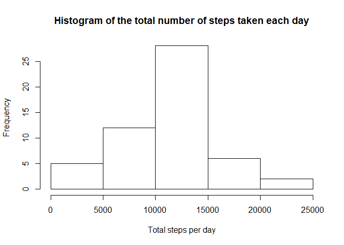
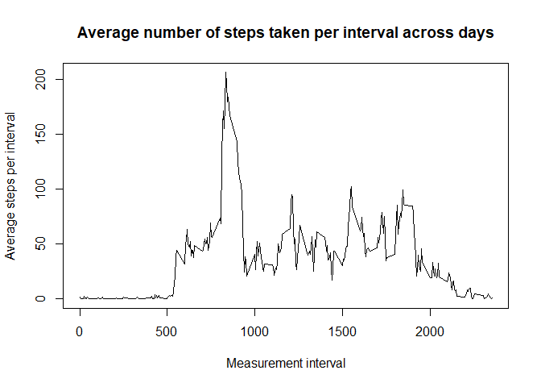
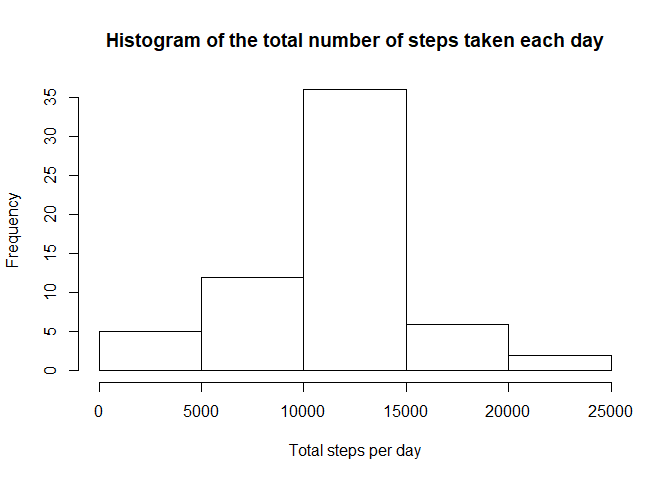
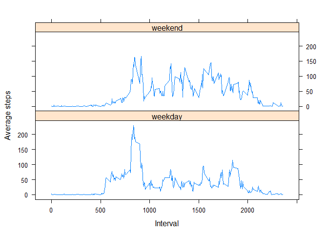

This document shows the code and results of the analysis on the activity
monitoring dataset, which includes data on the number of steps taken by a 
single individual over 5-minutes intervals across the whole day for two months.

## Loading and preprocessing the data


```r
    unzip("activity.zip")
    activity <- read.csv("activity.csv")
```

## What is mean total number of steps taken per day?


```r
    # 2. Histogram of the total number of steps taken each day
    stepsDaily <- aggregate(activity$steps ~ activity$date, FUN = sum, na.action = na.omit)
    hist(stepsDaily[,2], xlab = "Total steps per day", 
         main = "Histogram of the total number of steps taken each day")
```

<!-- -->

```r
    # 3. Mean and median number of steps taken each day
    stepsDailyMean <- mean(stepsDaily[,2], na.rm = TRUE)
    print(paste0("The mean number of steps per day is ", stepsDailyMean))
```

```
## [1] "The mean number of steps per day is 10766.1886792453"
```

```r
    stepsDailyMedian <- median(stepsDaily[,2], na.rm = TRUE)
    print(paste0("The median number of steps per day is ", stepsDailyMedian))
```

```
## [1] "The median number of steps per day is 10765"
```

## What is the average daily activity pattern?


```r
    # 4. Time series plot of the average number of steps taken per interval
    intervalNARM <- activity[which(!is.na(activity$steps)),]
    intervalAverage <- tapply(intervalNARM$steps, as.factor(intervalNARM$interval), FUN = mean)
    plot(intervalAverage ~ unique(intervalNARM$interval), type = "l", 
         xlab = "Measurement interval", ylab = "Average steps per interval",
         main = "Average number of steps taken per interval across days")
```

<!-- -->

```r
    # 5. The 5-minute interval that, on average, contains the maximum number of steps
    findInterval <- as.factor(intervalNARM$interval)[which(intervalAverage == max(intervalAverage))]
    print(paste0("The interval that on average contains the maximum number of steps is ",
                 as.character(findInterval)))
```

```
## [1] "The interval that on average contains the maximum number of steps is 835"
```

## Imputing missing values


```r
    findNA <- which(is.na(activity))
    print(paste0("The total number of rows with NAs is ", as.character(length(findNA))))
```

```
## [1] "The total number of rows with NAs is 2304"
```

```r
    for (i in seq_along(findNA))  {
        activity[findNA[i],"steps"] = intervalAverage[which(rownames(intervalAverage)==as.character(activity[findNA[i],"interval"]))]
    }

    # 7. Histogram of the total number of steps taken each day
    stepsDaily <- aggregate(activity$steps ~ activity$date, FUN = sum)
    hist(stepsDaily[,2], xlab = "Total steps per day", 
         main = "Histogram of the total number of steps taken each day")
```

<!-- -->

```r
    # Mean and median number of steps taken each day
    stepsDailyMean <- mean(stepsDaily[,2])
    print(paste0("The mean number of steps per day with imputed data is ", stepsDailyMean))
```

```
## [1] "The mean number of steps per day with imputed data is 10766.1886792453"
```

```r
    stepsDailyMedian <- median(stepsDaily[,2])
    print(paste0("The median number of steps per day with imputed data is ", stepsDailyMedian))
```

```
## [1] "The median number of steps per day with imputed data is 10766.1886792453"
```

## Are there differences in activity patterns between weekdays and weekends?


```r
    # 8. Panel plot comparing the average number of steps taken per 5-minute interval across weekdays and weekends
    library(lattice)
    library(dplyr)
```

```
## Warning: package 'dplyr' was built under R version 3.5.2
```

```
## 
## Attaching package: 'dplyr'
```

```
## The following objects are masked from 'package:stats':
## 
##     filter, lag
```

```
## The following objects are masked from 'package:base':
## 
##     intersect, setdiff, setequal, union
```

```r
    Sys.setlocale(category = "LC_TIME", locale = "C") # I need this line to have weekdays in English
```

```
## [1] "C"
```

```r
    activity$as.date <- as.Date(as.character(activity$date), "%Y-%m-%d")   
    activity$weekdays <- weekdays(activity$as.date, FALSE)
    activity$week.end <- recode(factor(activity$weekdays), 
                                "Monday" = "weekday",
                                "Tuesday" = "weekday",
                                "Wednesday" = "weekday",
                                "Thursday" = "weekday",
                                "Friday" = "weekday",
                                "Saturday" = "weekend",
                                "Sunday" = "weekend")

    wActivity <- group_by(activity, week.end, interval) %>% 
      summarize(mInterval = mean(steps)) %>% 
      ungroup
    xyplot(wActivity$mInterval ~ wActivity$interval | wActivity$week.end, layout = c(1, 2), type = "l",
           xlab = "Interval", ylab = "Average steps")
```

<!-- -->
